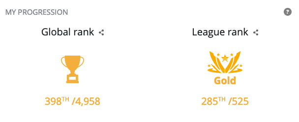

# Codingame Spring Challenge 2020

This is my bot for the **Codingame Spring Challenge 2020** contest that lasted from 7th-18th of May.

It was challenging and super fun coding multiplayer game. I encourge you to try it out: https://www.codingame.com/multiplayer/bot-programming/spring-challenge-2020

> Control a team of pacs and eat more pellets than your opponent. Beware, an enemy pac just might be waiting around the corner to take a bite out of you!

I finished in **Gold League** and was aiming for the Legend league, but the competition was fierce!

I was using **PHPStorm** and **Coding Sync Beta** (https://www.codingame.com/forum/t/codingame-sync-beta/614) to sync my changes directly to the **Codingame IDE**. 

The `compile.php` is parsing all required php files and merging them in that order into `build/compiled.php` file that later will be uploaded using the **Coding Sync Beta**.

I am also using the **PHPStorm** `File Watchers` setting that watches for any changes in the `src/` folder and running the `compile.php` automatically which triggers the **Coding Sync Beta** as well.

I am using different strategies to optimise the pacs and using **Breadth-first search (BFS)** as main path finding algorithm.
https://en.wikipedia.org/wiki/Breadth-first_search
